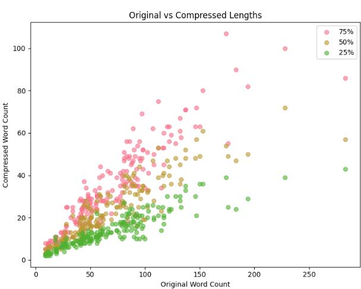

# SPAR Trial Task

### By Bryan Sukidi

Here's my research process from start to finish. This will be a live document that I update as I go. 

---
### First Steps
* **Goal:** We want to know how much model performance deteriorates on the GPQA-diamond dataset for a given amount of compression. In other words, if we compress the prompt down by a certain amount, does the model get better or worse at our benchmark?
* **My Intuition:** Model performance will go down as the prompt gets compressed, because the model will have less information to work with. 
  * Compression might improve performance if the prompt contains a lot of irrelevant information? (Unlikely since prompts are written by experts)

**Here's the high-level plan:**

1. Load GPQA-diamond
2. Explore compression methods
   1. Try out different prompts on Claude playground, see how the model performs
   2. Figure out what tips to give model without restricting it (set temperature to 0.3)
3. Implement pipeline to compress questions
   1. Input: GPQA dataset  
   2. Output: GPQA dataset w/ new columns for each compressed prompt
4. Evaluate model performance on GPQA-diamond for each compression level for each question
   1. Model: "claude-3-5-sonnet-20241022". Used frontier model for eval, updated to work w/ latest API's
   2. Prompting: Five-shot examples w/ CoT. Adjusted GPQA to allow for both

**Here are a couple of difficulties I think I'll encounter:**

1. The GPQA repository is 2+ years old... will have to do some refactoring and updating
2. Need to define compression; how to control for starting words / amount of information?
   2. Suppose you have two questions that are conceptually the same in difficulty, but one just has more "basic facts" than the other (i.e. atomic units of information that help define the question). This seems like it's outside the scope of this assignment, but would be interesting to look into model deterioration w.r.t. number of atomic facts being compressed.
3. Dealing w/ math and chemistry might be particularly challenging because you have to parse through symbols/equations/formulas/etc.


## Compression

*TLDR: compress questions using percentages of words in original sentence.*

First, I calculated the number of starting words in the original question by splitting on whitespace. Then I used a prompt template to generate four questions w/ Claude containing 100%, 75%, 50%, and 25% of the number of starting words in the original question. Here's the exact prompt I used:

```
You are an expert at compressing questions while preserving the core intent and meaning. Your task is to create multiple compressed versions of a question, each with an EXACT number of words, whilst preserving the overall question intent. The goal is for the compressed question to be as accurate as possible while still capturing the essential information.

CRITICAL INSTRUCTIONS:
1. Preserve the CORE INTENT of the question. The compressed version should test the same knowledge and expect the same answer.
2. NEVER add information that wasn't in the original question.
3. Count hyphenated words (e.g., "state-of-the-art") as ONE word.
4. Numbers (e.g., "42" or "3.14") count as ONE word.
5. You may use shortened forms, remove articles, or use other compression techniques as long as the core intent remains clear.
6. You MUST output EXACTLY the specified number of words for each compression. If you go over or under, you fail.

Original question ({original_word_count} words):
{question}

Generate ALL of the following compressions with EXACT word counts:

{target_75} words:
[Your compression with EXACTLY {target_75} words]

{target_50} words:
[Your compression with EXACTLY {target_50} words]

{target_25} words:
[Your compression with EXACTLY {target_25} words]
```

**Why this approach is good:**
1. **Better than simply having a binary of "compressed" or "not compressed"**
2. **Using words feels more natural.** It's more intuitive for models to count words than tokes. Using tokens probably would have been best, but would have required me to do individual requests for each compression (so I went with words for this)
3. **Allows statements in math and chemistry to be compressed** without having to impose arbitrary rules on characters or tokens, since we can count formulas/symbols/etc as one word. 

**Why this approach is bad:** 
1. **I used a single API request to generate all compressions for each question.** If I generated each compression individually, I probably could've imposed some token limit on the API, which would have increased the precision of the compressions. My main reason for doing this is because I wanted to save on costs and time. 
2. **The model is really bad at following the word count, despite extensive instructions.** The graph below shows that the model often generates **far less** words than the target word count.  
   1. **This means that 75% isn't actually 75%; it's more like 50% or less.** I believe this is an important limitation and point to make. 
   2. 
3. **Using percentages has its flaws.** 50% of 100 words is way different than 50% of 25 words, so these might not be directly comparable.
4. **Needs more testing for temperature.** My assumption is that lower temp => more deterministic => model stays grounded in essential information that it'll eventually compress. But you still need to provide some creative freedom so that the model can compress the text. 
   1. decided on temp=0.3. This is because I want the ability to adhere to the word count and core information, but I also want to give the model some creative freedom to compress the text


**Future Directions**
- *Control for amounnt of essential information in a problem*

Suppose you have two questions that are conceptually similar in difficulty, but one just has more essential information than the other. I would guess that compression performance has more to do with essential information than difficulty, because then the question becomes a semantic ambiguity problem, in addition to being conceptually difficult/computationally intensive. 


