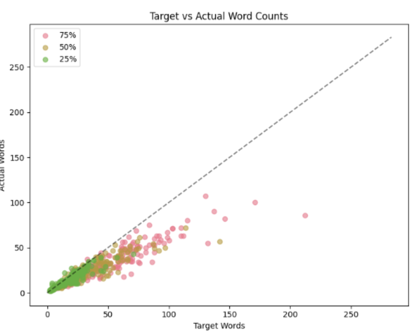
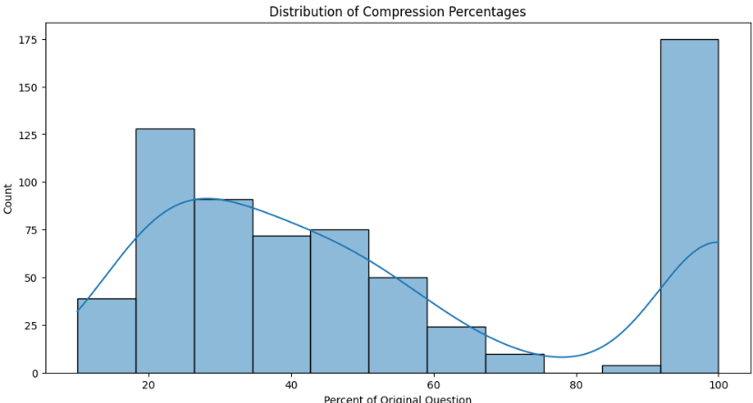
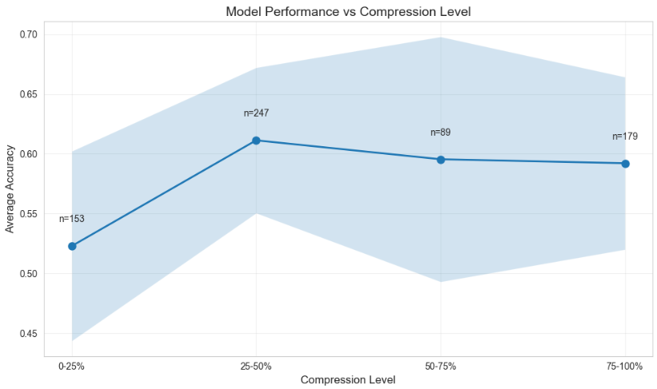
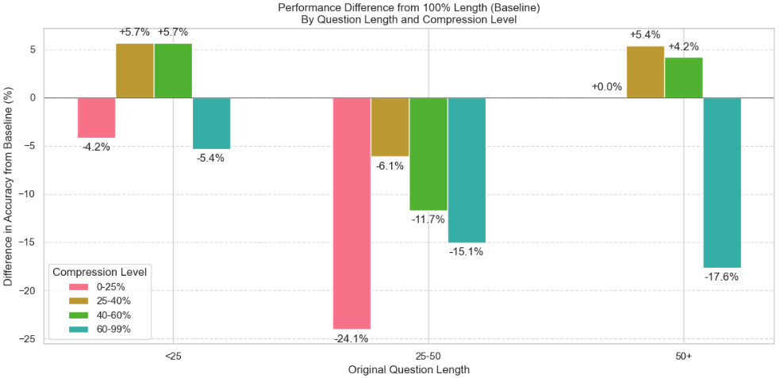
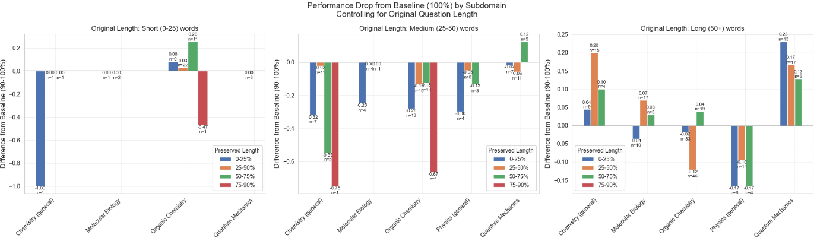
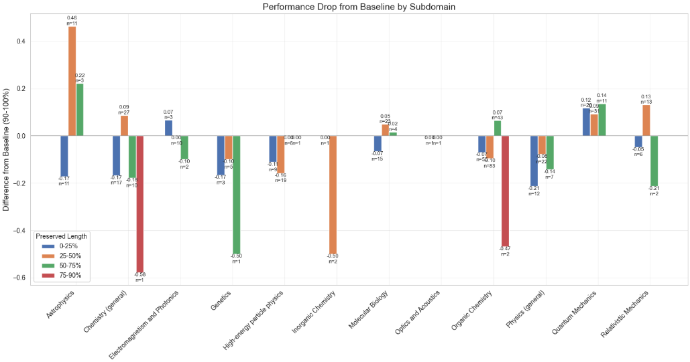

# SPAR Trial Task

### By Bryan Sukidi

Here's my research process from start to finish. This will be a live document that I update as I go.

---

### First Steps

- **Goal:** We want to know how much model performance deteriorates on the GPQA-diamond dataset for a given amount of compression. In other words, if we compress the prompt down by a certain amount, how much better/worse does the model e
- **My Intuition:** Model performance will go down as the prompt gets compressed, because the model will have less information to work with.
  - Compression might improve performance if the prompt contains a lot of irrelevant information? (But I'd guess this is unlikely since prompts are written by experts)

**Here's the high-level plan:**

1. Load GPQA-diamond
2. Explore compression methods
   1. Try out different prompts on Claude playground, see how the model performs
   2. Figure out what tips to give model without restricting it (set temperature to 0.3)
3. Implement pipeline to compress questions
   1. Input: GPQA dataset
   2. Output: GPQA dataset w/ new columns for each compressed prompt
4. Evaluate model performance on GPQA-diamond for each compression level for each question
   1. Model: "claude-3-5-sonnet-20241022". Used frontier model for eval, updated to work w/ latest API's
   2. Prompting: Five-shot examples w/ CoT. Adjusted GPQA to allow for both

**Here are a couple of difficulties I think I'll encounter:**

1. The GPQA repository is 2+ years old... will have to do some refactoring and updating
2. Need to define compression; how to control for starting words / amount of information?
   - Suppose you have two questions that are conceptually the same in difficulty, but one just has more "basic facts" than the other (i.e. atomic units of information that help define the question). How can we control for this? 
3. Adapting evaluation script to handle evaluating multiple question compressions
4. Dealing w/ math and chemistry might be particularly challenging because you have to parse through symbols/equations/formulas/etc.

## Compression

_TLDR: I define compression as the percentage of the original question that is preserved. For each question, I generate four total compressed questions. where I attempted to control for the model's response word count._

#### Attempt #1: Compression As Quartiles

My initial goal was to compress the question into 100%, 75%, 50%, and 25% of the original question. I did this in `scripts/generate_compressions.py`

1. First, I calculated the number of starting words for each question in the GPQA-diamond dataset. I accomplished this by splitting on whitespace and counting non-empty strings.
2. Then, I used a prompt template to generate four questions w/ Claude containing 100%, 75%, 50%, and 25% of the number of starting words in the original question. Here's the exact prompt I used:

```
You are an expert at compressing questions while preserving the core intent and meaning. Your task is to create multiple compressed versions of a question, each with an EXACT number of words, whilst preserving the overall question intent. The goal is for the compressed question to be as accurate as possible while still capturing the essential information.

CRITICAL INSTRUCTIONS:
1. Preserve the CORE INTENT of the question. The compressed version should test the same knowledge and expect the same answer.
2. NEVER add information that wasn't in the original question.
3. Count hyphenated words (e.g., "state-of-the-art") as ONE word.
4. Numbers (e.g., "42" or "3.14") count as ONE word.
5. You may use shortened forms, remove articles, or use other compression techniques as long as the core intent remains clear.
6. You MUST output EXACTLY the specified number of words for each compression. If you go over or under, you fail.

Original question ({original_word_count} words):
{question}

Generate ALL of the following compressions with EXACT word counts:

{target_75} words:
[Your compression with EXACTLY {target_75} words]

{target_50} words:
[Your compression with EXACTLY {target_50} words]

{target_25} words:
[Your compression with EXACTLY {target_25} words]
```

**Why this approach was bad:** 
1. **Imposing a word count limit on an LLM can be unreliable.** I learned quickly that if you tell a model to keep only 75% or 50% or 25% of something, it will often generate a response far less than what was requested (must be tokenization issue). 
2. To visualize this discrepancy, here's a graph of the target word count vs. the actual generated word count for each compression question. Ideally all our questions would fall on the line, but the vast majority do not.
   

#### Attempt #2: Compression As A Continuous Percentage

I liked having four data points (i.e. "compression levels") per question, but it was clear I couldn't get the model to compress perfectly to 75%, 50%, and 25%. So instead, I just took the same data and divided the _word count_ of each compressed question by the _word count_ of the original question. (So if I had 20 words in the original question, and GPT generated 10 words for the second q, 8 for the third q, etc), I would just divide each by 20. 

This resulted in the following distribution, where the x-axis is the percent of the original question kept. 



**Why this approach is good:**

1. **It's better than simply having a binary of "compressed" or "not compressed"**
2. **Saves on cost/time** because you can use a single API request to generate all compressions for each question, as opposed to imposing token limits

**Why this approach is bad:**

1. **I used a single API request to generate all compressions for each question.** If I generated each compression individually, I probably could've imposed some token limit on the API, which would have increased the precision of the compressions. My main reason for doing this is because I wanted to save on costs and time.
2. **Using percentages leads to different results depending on number of original words.** For example, 50% of 100 words is way different than 50% of 25 words, so these might not be directly comparable.
3. **Needs more testing for temperature.** My assumption is that lower temp => more deterministic => model stays grounded in essential information that it'll eventually compress. But you still need to provide some creative freedom so that the model can compress the text. (decided on temp=0.3)

## Evaluation

To run my evaluation, I used five-shot prompt w/ CoT with Claude-3-5-sonnet-20241022 and temperature=0.3. I had to make a few modifications to the evaluation script in `scripts/run_experiment.py`. The input was `datasets/compressions.csv` and the output was a series of eval files which I merged to get `final_results.csv`. Each row in `final_results.csv` corresponds a question id `datasets/compressions.csv`, and the columns contain information on each of the four question compressions.

### Overall Statistics

- **Total Accuracy**: 58.38%
- **Total Correct**: 390
- **Total Samples**: 668

Note: GPQA-diamond contains 198 rows, so why do I have 668 samples?

1. I evaluated 176 unique questions before Anthropic stopped me.
   - 176 questions \* 4 compressions/question = 672 samples
2. I had to remove 4 rows that failed somewhere in the process, bringing the total to 668.

Claude typically gets around ~60% accuracy on GPQA-diamond, so this was a good sanity check.

### Accuracy by High-level Domain

Performs relatively worse on Chemistry questions.

| Domain    | Count | Accuracy (%) | Std Dev |
| --------- | ----- | ------------ | ------- |
| Biology   | 70    | 67.14        | 47.31   |
| Chemistry | 327   | 45.87        | 49.91   |
| Physics   | 271   | 71.22        | 45.36   |

### Accuracy by Subdomain

| Subdomain                      | Count | Accuracy (%) | Std Dev |
| ------------------------------ | ----- | ------------ | ------- |
| High-energy particle physics   | 47    | 91.49        | 28.21   |
| Quantum Mechanics              | 84    | 76.19        | 42.85   |
| Inorganic Chemistry            | 4     | 75.00        | 50.00   |
| Relativistic Mechanics         | 28    | 75.00        | 44.10   |
| Molecular Biology              | 57    | 73.68        | 44.43   |
| Physics (general)              | 55    | 61.82        | 49.03   |
| Electromagnetism and Photonics | 20    | 60.00        | 50.26   |
| Astrophysics                   | 34    | 55.88        | 50.40   |
| Chemistry (general)            | 74    | 54.05        | 50.18   |
| Organic Chemistry              | 249   | 42.97        | 49.60   |
| Genetics                       | 13    | 38.46        | 50.64   |
| Optics and Acoustics           | 3     | 0.00         | 0.00    |

## Accuracy w.r.t. Compression

**Note:** The "compression level" is calculated by taking the number of words in the compressed question, and dividing by the number of words in the original question. Low % means LOTS of compression; high % means little to no compression.

Here's a graph comparing model performance on GPQA-diamond and compression level. 
**Key Finding 1: (~70% confidence)** more compression (word count < 25% of original prompt) weakly implies lower accuracy, but not significantly. 


To mitigate some of the issues w/ compression as a relative percentage, we can analyze question accuracy using the **absolute** word count of the starting question. One of the things we might want to know is if the number of words in the original question is correlated with more or less model deterioration when we attempt to compress it. In other words, if the original question is long, does that make the compressed versions of that question more or less robust to compression when assessed on accuracy?


When we treat the original question as a baseline, we get the following graph.
**Key Finding #2: (~70% confidence)** For original questions that have 25-50 words, compressing leads to up to -24% drop in accuracy.
**Key Finding #3: (~30% confidence)** There some compressions that benefit model performance on both <25 words and 50+ word questions, but only by a small margin. Still not sure how much I should trust this analysis.




### Subdomain

**Key Finding #5:** For starting questions between 25-50 words, compression leads to drops of 30-70% for organic chemistry and chemistry.

**Key Finding #6:** For starting questions with 50+ words, compression increases accuracy for quantum mechanis and chemistry by 2%.



**Key Finding #7:** Performance drops across all subdomains, not controlling for initial question length. Exception w/ astrophysics (left).



